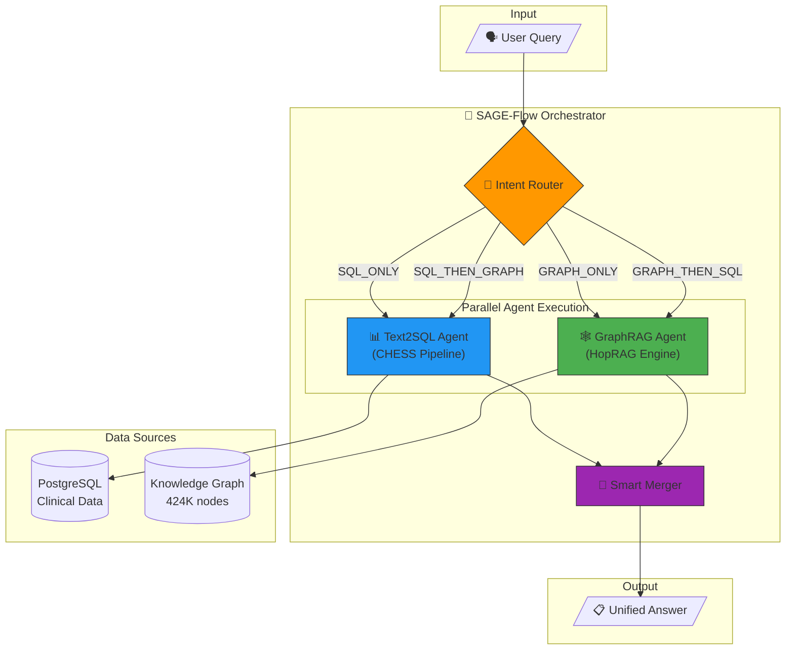
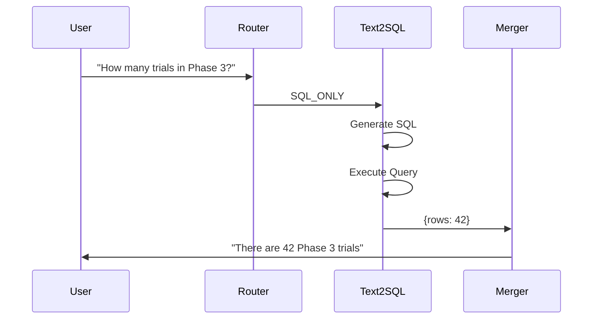
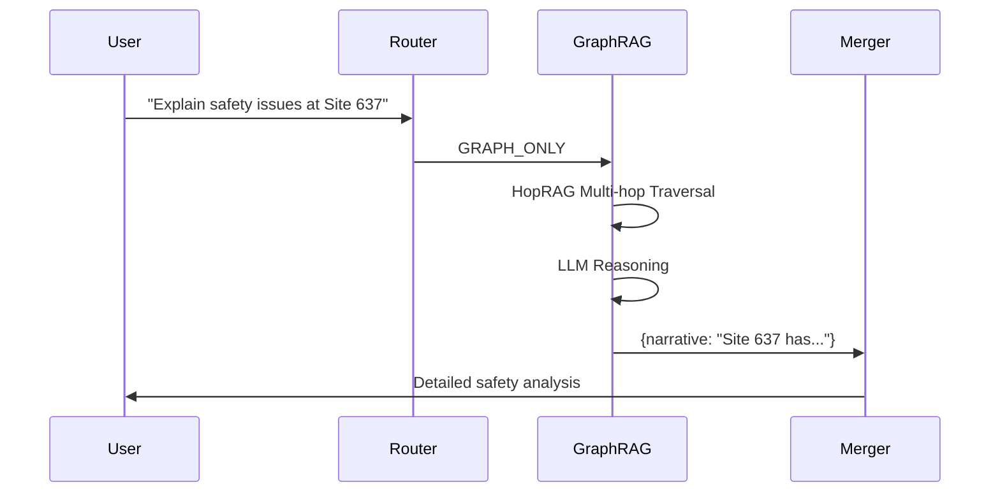
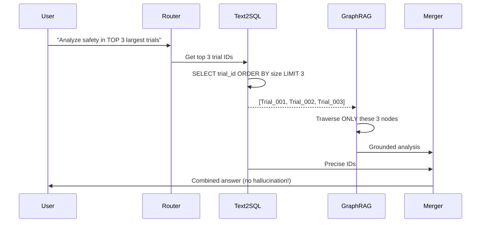
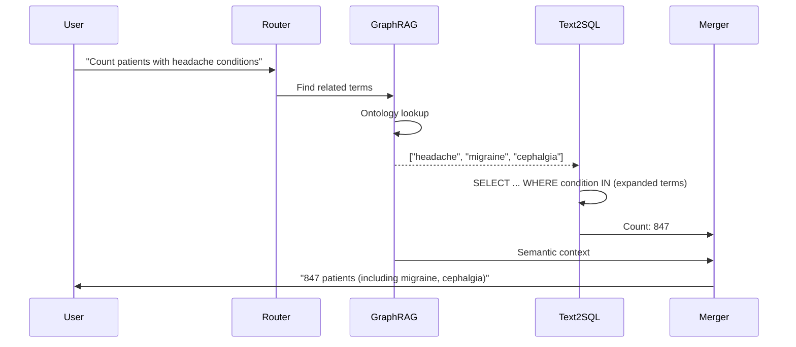

# SAGE-Flow: SQL-Augmented Graph Execution Flow

A novel framework combining **Text2SQL** and **GraphRAG** for intelligent clinical trial data analysis.

## 🎯 The Problem

| Approach | Strength | Weakness |
|----------|----------|----------|
| **SQL** | Precise aggregations, filtering, statistics | No context, relationships, or reasoning |
| **Graph RAG** | Rich relationships, multi-hop reasoning | Struggles with "top N", exact counts |

**SAGE-Flow** combines both - routing queries to the optimal path and fusing results intelligently.

---

## 🏗️ Architecture



---

## 🔄 Execution Flows

### Flow 1: SQL Only


### Flow 2: Graph Only


### Flow 3: SQL → Graph (Grounded Traversal)


### Flow 4: Graph → SQL (Semantic Expansion)


---

## 📦 Project Structure

```
sage_flow/               # 🔮 Main SAGE-Flow Module
├── orchestrator.py      # Entry point, parallel execution
├── router.py            # Fast heuristics + LLM classification
├── merger.py            # Trust hierarchy, conflict detection
└── prompts.py           # LLM prompts

graph_rag/               # 🕸️ GraphRAG Components
├── agent.py             # LangChain ReAct agent
├── hop_rag/             # Multi-hop reasoning engine
│   ├── engine.py        # HopRAG core
│   └── config.py        # Tunable parameters
└── tools/               # Graph query tools

pipeline/                # 📊 Text2SQL (CHESS)
└── orchestrator.py      # 5-agent SQL pipeline

agents/                  # CHESS SQL Agents
├── information_retriever.py
├── schema_selector.py
├── candidate_generator.py
├── unit_tester.py
└── result_explainer.py
```

---

## 🚀 Quick Start

```python
from sage_flow import create_sage_flow

orchestrator = create_sage_flow(verbose=True)
result = orchestrator.query("Which sites require immediate attention?")
print(result.answer)
```

```bash
cd sage_flow && python orchestrator.py
```

---

## ⚡ Performance

| Metric | Value |
|--------|-------|
| Routing | ~1s |
| SQL | ~0.5s |
| Graph | 3-8s |
| **Total** | **5-15s** |

---

## 🔧 Configuration

Edit `graph_rag/hop_rag/config.py`:
```python
@dataclass
class HopRAGConfig:
    n_hops: int = 3                    # Traversal depth
    use_llm_reasoning: bool = True     # Enable LLM for edge selection
    max_llm_calls_per_query: int = 5   # LLM call budget
    fast_mode_threshold: float = 0.9   # Skip LLM if high confidence
```

---

*SAGE-Flow: Combining the precision of SQL with the intelligence of Graphs.*
