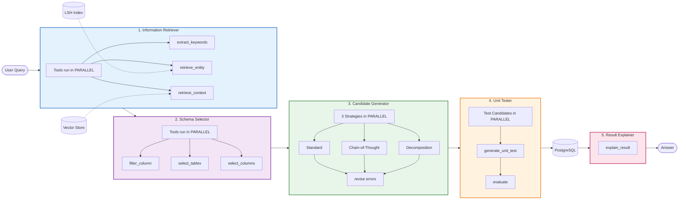

# NEXUS Text-to-SQL for Clinical Trial Data

**NEXUS** - **N**atural language **EX**ecution and **U**nderstanding **S**ystem

A multi-agent Text-to-SQL system designed for querying clinical trial data using natural language.

## Architecture

The system uses 4 main agents with sub-agents/tools working in parallel to deliver accurate results.

### System Overview



### 1. Information Retriever Agent (IR)
Gathers relevant information from the database and question.
**Tools:**
- `extract_keywords` - Extracts key terms using LLM
- `retrieve_entity` - Searches database values using LSH + edit distance
- `retrieve_context` - Gets relevant schema descriptions from vector store

### 2. Schema Selector Agent (SS)
Reduces schema size by selecting relevant tables and columns.
**Tools:**
- `filter_column` - Determines column relevance
- `select_tables` - Selects necessary tables
- `select_columns` - Narrows down to essential columns

### 3. Candidate Generator Agent (CG)
Generates and refines SQL query candidates in parallel.
**Tools:**
- `generate_candidate_query` - Generates SQL using multiple parallel strategies:
  - **Standard**: Direct generation
  - **Chain-of-Thought**: Step-by-step reasoning
  - **Decomposition**: Breaking down complex queries
- `revise` - Fixes faulty queries based on execution errors

### 4. Unit Tester Agent (UT)
Selects the best SQL candidate using generated unit tests.
**Tools:**
- `generate_unit_test` - Creates synthetic tests to differentiate candidates
- `evaluate` - Runs candidates against tests to find the most robust one

### 5. Result Explainer Agent (RE)
Converts the SQL execution results into a natural language response.
**Tools:**
- `explain_result` - Generates a user-friendly summary of the data


## Preprocessing

The system uses two preprocessing techniques for efficiency:

1. **LSH (Locality Sensitive Hashing)** - Indexes database values for fast entity retrieval
2. **Vector Database** - Stores schema descriptions for semantic similarity search

## Installation

```bash
# Clone the repository
cd Nova-text-to-sql

# Install dependencies
pip install -r requirements.txt

# Copy and configure environment variables
cp .env.example .env
# Edit .env with your Groq API key and PostgreSQL credentials
```

## Configuration

Edit `.env` file:

```env
# Groq API Key (get from https://console.groq.com/)
GROQ_API_KEY=your_groq_api_key_here

# PostgreSQL Configuration
DB_HOST=localhost
DB_PORT=5432
DB_NAME=clinical_trials
DB_USER=postgres
DB_PASSWORD=your_password
```

## Usage

### 1. Setup (First Time)

```bash
# Load data and build indices
python -m cli.main setup
```

### 2. Query Data

```bash
# Single query
python -m cli.main query "How many patients are in Study 1?"

# With verbose output
python -m cli.main query "Show sites with open queries" --verbose

# Generate more candidates
python -m cli.main query "Find missing visits" --candidates 5
```

### 3. Interactive Mode

```bash
python -m cli.main interactive
```

### 4. Python API

```python
from nexus_sql import create_pipeline

# Create pipeline
pipeline = create_pipeline()

# Run query
result = pipeline.run("How many open queries are there by site?")

# Access results
print(result.sql)
print(result.execution_result)
print(result.summary())
```

### 5. REST API

```bash
# Start the API server
python -m api.server

# Or with uvicorn
uvicorn api.server:app --reload --port 8000
```

**Endpoints:**
- `POST /query` - Run a natural language query
- `POST /query/batch` - Run multiple queries
- `GET /health` - Health check
- `GET /schema` - Get database schema
- `GET /docs` - Swagger UI documentation

**Example Request:**
```bash
curl -X POST http://localhost:8000/query \
  -H "Content-Type: application/json" \
  -d '{"question": "How many studies are there?", "execute": true}'
```

## Project Structure

```
Nova-text-to-sql/
├── agents/                     # Agent implementations
│   ├── base_agent.py          # Base classes for agents and tools
│   ├── information_retriever.py  # IR Agent
│   ├── schema_selector.py     # SS Agent
│   ├── candidate_generator.py # CG Agent
│   └── unit_tester.py         # UT Agent
├── config/
│   └── settings.py            # Configuration settings
├── database/
│   ├── connection.py          # PostgreSQL connection manager
│   ├── data_loader.py         # Excel to PostgreSQL loader
│   └── schema_manager.py      # Schema extraction and caching
├── preprocessing/
│   └── indexer.py             # LSH and Vector DB indices
├── pipeline/
│   └── orchestrator.py        # Pipeline coordinator
├── nexus_bench/                # NEXUS-BENCH evaluation framework
│   ├── run_evaluation.py      # Evaluation runner
│   └── new_testbench.json     # Test cases (25 questions)
├── cli/
│   └── main.py                # Command-line interface
├── utils/
│   ├── llm_client.py          # Groq API client
│   └── token_utils.py         # Token counting utilities
├── nexus_sql.py               # Main entry point
├── requirements.txt
└── README.md
```

## Clinical Trial Data Categories

The system handles these data categories:
- **visit** - Patient visit tracking and projections
- **query** - Data queries and EDRR metrics
- **safety** - eSAE and safety data
- **coding** - Medical coding (MedDRA, WHODD)
- **lab** - Laboratory data and reconciliation
- **edc_metrics** - EDC performance metrics
- **forms** - Form status (frozen, locked, signed)
- **pages** - Missing pages reports

## Example Queries

```
# Patient/Site Queries
"How many patients are in Study 5?"
"Which sites have the most missing visits?"
"Show patient enrollment by region"

# Data Quality Queries
"How many open queries are there?"
"Which sites have non-conformant data?"
"Show query resolution rates by site"

# Safety Queries
"List eSAE events by study"
"Which patients have adverse events?"

# Aggregation Queries
"Show missing visit percentages by site"
"Calculate clean patient rates"
```

## Token Optimization

The system implements several token optimization strategies:
1. **Keyword extraction** - Only relevant terms are used for retrieval
2. **Schema filtering** - Only necessary tables/columns included
3. **Progressive detail** - Compact to detailed schema as needed
4. **Batched filtering** - Column filtering in batches

## Models Used

The system uses Groq's LLM models:
- `llama-3.3-70b-versatile` - For SQL generation and complex reasoning
- `llama-3.1-8b-instant` - For fast evaluation and filtering tasks

## NEXUS-BENCH Evaluation

**NEXUS-BENCH** (Natural language EXecution and Understanding System Benchmark) is our comprehensive evaluation framework for testing Text-to-SQL systems on clinical trial data.

### Overview

- **25 curated test cases** across 3 difficulty levels
- **8 clinical trial tables** covering study metrics, safety data, coding records, and more
- **Multiple query categories**: count, aggregation, filtering, joins, and complex analytics

### Difficulty Levels

| Level | Count | Description |
|-------|-------|-------------|
| Easy | 10 | Single-table queries with basic counts and filters |
| Medium | 10 | Group-by aggregations, distinct counts, filtered max |
| Hard | 5 | Multi-table joins, percentages, complex analytics |

### Query Categories

- `count` - Basic record counting
- `aggregation` - SUM, MAX, AVG operations
- `count_filter` - Counting with WHERE conditions
- `count_distinct` - Distinct value counting
- `group_by_max` - Finding top values per group
- `percentage` - Ratio calculations
- `multi_table_sum` - Cross-table aggregations
- `top_n` - Ranking queries

### Running Evaluations

```bash
# List all available tests
python -m nexus_bench.run_evaluation --list

# Run by difficulty
python -m nexus_bench.run_evaluation --easy              # Easy tests only
python -m nexus_bench.run_evaluation --medium            # Medium tests only
python -m nexus_bench.run_evaluation --hard              # Hard tests only
python -m nexus_bench.run_evaluation --easy --medium     # Easy + Medium
python -m nexus_bench.run_evaluation --all               # All tests

# Run specific tests by ID
python -m nexus_bench.run_evaluation --ids 1 2 3         # Specific IDs
python -m nexus_bench.run_evaluation --ids 1-5 10-15     # ID ranges

# Run by category
python -m nexus_bench.run_evaluation --category count aggregation

# Options
python -m nexus_bench.run_evaluation --all --quiet       # Minimal output
python -m nexus_bench.run_evaluation --all -o results.json  # Custom output path
```

### Benchmark File

The benchmark is defined in `nexus_bench/new_testbench.json` with structured test cases including:
- Natural language questions
- Expected answers with types
- Required tables
- Difficulty and category labels

## License

MIT License
