# 🧠 SAGE-CODE: Schema-Aware Graph Explorer with Code-Augmented Reasoning

> **S**chema-**A**ware **G**raph **E**xplorer with **C**hain-**O**f-thought **D**riven **E**xecution

A novel multi-modal reasoning framework that seamlessly integrates **Knowledge Graph Traversal**, **LLM-powered Chain-of-Thought Reasoning**, and **Dynamic Code Execution** for complex analytical queries over clinical trial data.

---

## 🎯 Core Innovation

SAGE-CODE introduces a **Hybrid Reasoning Loop** that dynamically switches between:
- **Graph Traversal** for relational queries (e.g., "Which sites are in Study 15?")
- **Code Execution** for analytical queries (e.g., "Which sites have the most issues?")

Unlike traditional RAG systems that treat retrieval and generation as separate phases, SAGE-CODE maintains a **unified reasoning state** that guides both graph exploration and code synthesis.

---

## 🏗️ Architecture Overview

```mermaid
flowchart TB
    subgraph Input["📥 Input Layer"]
        Q[User Query]
    end

    subgraph QueryAnalysis["🔍 LLM Query Analysis"]
        QA[Query Classifier]
        QA -->|ANALYTICAL| CodePath
        QA -->|RELATIONAL| GraphPath
    end

    subgraph InitialRetrieval["🎯 Initial Retrieval"]
        KW[Keyword Index Lookup]
        TF[Type Fallback]
        LLM_IR[LLM-Guided Retrieval]
    end

    subgraph GraphPath["🕸️ Graph Reasoning"]
        BS[Batched LLM Scoring]
        CoT[CoT Traversal]
        Beam[Beam Filtering]
    end

    subgraph CodePath["💻 Code Reasoning"]
        CG[Code Generation]
        CE[Sandboxed Execution]
        CR[Code Retry Loop]
    end

    subgraph SchemaContext["📊 Schema Context Injection"]
        DF[DataFrame Schemas]
        DK[Data Keys Info]
    end

    subgraph Output["📤 Output"]
        Ctx[Rich Context]
        Agent[LLM Agent Response]
    end

    Q --> QA
    QA --> KW
    KW --> TF
    TF --> LLM_IR
    LLM_IR --> BS
    BS --> CoT
    CoT -->|TRAVERSE| Beam
    Beam --> BS
    CoT -->|CODE| CG
    CG --> CE
    CE -->|Error| CR
    CR --> CG
    CE -->|Success| Ctx
    CoT -->|SUFFICIENT| Ctx
    Ctx --> Agent
    SchemaContext -.-> CG
    SchemaContext -.-> CoT
```



---

## 🔬 Detailed Pipeline

### Phase 1: Query Analysis


**Query Analysis Prompt:**
```
Analyze this clinical trial query and determine:
1. query_type: "ANALYTICAL" (needs aggregation) or "RELATIONAL" (needs traversal)
2. target_types: List of node types to search [Site, Study, Subject, ...]
3. key_entities: Specific entity IDs mentioned

Query: "{query}"
```

---

### Phase 2: Initial Retrieval


**Structural Boost Weights:**
| Node Type | Boost Score | Rationale |
|-----------|-------------|-----------|
| Subject | +0.3 | Bridge between Site/Study and data |
| MissingPage | +0.4 | High-value analytical target |
| SafetyDiscrepancy | +0.4 | High-value analytical target |
| Visit | +0.2 | Container for clinical data |
| Site | +0.2 | Key aggregation entity |

---

### Phase 3: Batched LLM Scoring

```mermaid
flowchart LR
    subgraph BatchedScoring["Batched Candidate Scoring"]
        C[All Candidates]
        B1[Batch 1: 20 nodes]
        B2[Batch 2: 20 nodes]
        Bn[Batch N: ≤20 nodes]
        
        L1[LLM Call 1]
        L2[LLM Call 2]
        Ln[LLM Call N]
        
        S[Aggregated Scores]
    end

    C --> B1 & B2 & Bn
    B1 --> L1
    B2 --> L2
    Bn --> Ln
    L1 & L2 & Ln --> S
```



**Batch Selection Prompt:**
```
Rate relevance (0-10) of each candidate for the query.
Consider:
1. Explicit matches (keywords)
2. Semantic relationships
3. **DATA POTENTIAL**: Score HIGHER if node is a key in dataframes

Available DataFrames:
{dynamic_data_context}

Candidates:
[0] Site 637 (Site) - LOCATED_IN [DATA_AGGR_KEY]
[1] Subject 123 (Subject) - ENROLLED_IN
...
```

**Novel: Data-Aware Tagging**
Nodes that can be used as aggregation keys in dataframes receive the `[DATA_AGGR_KEY]` tag, signaling higher computational potential.

---

### Phase 4: Chain-of-Thought Guided Traversal


**CoT Reasoning Prompt:**
```
You are a clinical trial data analyst with Python Pandas capabilities.

DECISION RULES:
1. Use CODE if query asks for: counts, rankings, statistics
2. Use TRAVERSE only to find specific entity IDs
3. Use SUFFICIENT if answer already found

CODE TIPS:
- Use print() to show results
- Combine dataframes with pd.merge()
- Group by site/study for rankings

Response (JSON):
{
  "thought": "Brief analysis...",
  "action": "CODE" | "TRAVERSE" | "SUFFICIENT",
  "code": "...",
  "selected_indices": []
}
```

---

### Phase 5: Code Execution with Retry


**Code Retry Prompt (with Error History):**
```
The code failed. Here are ALL the errors so far (DO NOT repeat):
Attempt 1: Error: 'Series' has no attribute 'reset_name'
Attempt 2: Error: name 'df' is not defined

Original query: {query}
Last failed code: {code}

Available DataFrames: esae_processed_df, missing_pages_processed_df, ...

Fix the code and return ONLY corrected Python code:
```

**Sandboxed Executor Features:**
- Pre-loaded DataFrames as variables
- Auto-fix common LLM mistakes (`.to_frame()`, `pd.read_csv`)
- Auto-wrap expressions in `print()`
- Restricted `__builtins__` for security

---

### Phase 6: Schema Context Injection


**Generated Schema Context:**
```
### DataFrame: esae_processed_df
- Shape: (17098, 11)
  * discrepancy_id (object): e.g., [68259, 68260, ...]
  * study_id (object): e.g., [Study 21, Study 22, ...]
  * site (object): e.g., [Site 1114, Site 1336, ...]
  * review_status (object): e.g., [Pending for Review, ...]
```

---

## 🔧 Component Details

### 1. Knowledge Graph Structure

| Entity Type | Attributes | Relationships |
|-------------|------------|---------------|
| Study | study_id, status, phase | HAS_SITE, HAS_SUBJECT |
| Site | site_id, country | BELONGS_TO_STUDY, HAS_SUBJECT |
| Subject | subject_id, status | ENROLLED_AT_SITE, HAS_VISIT |
| Visit | visit_id, date | SCHEDULED_FOR, HAS_FORM |
| SafetyDiscrepancy | id, status | REPORTED_BY, AFFECTS |
| MissingPage | form_id, days_missing | MISSING_FOR |

### 2. LLM Call Budget

| Phase | LLM Calls | Purpose |
|-------|-----------|---------|
| Query Analysis | 1 | Classify query type |
| Batch Scoring | N/batch_size | Score candidates |
| CoT Reasoning | 1 per hop | Decide next action |
| Code Retry | 0-3 | Fix failed code |
| **Total** | **~3-6 per query** | |

### 3. Configuration Parameters

```python
@dataclass
class SAGECODEConfig:
    # Traversal
    n_hops: int = 3
    top_k: int = 15
    beam_width: int = 20
    
    # Scoring
    selection_batch_size: int = 20
    max_candidates_to_score: int = 40
    
    # Code Execution
    max_code_retries: int = 3
    
    # Budget
    max_llm_calls_per_query: int = 10
    max_total_time_seconds: int = 45
```

---

## 📊 Experimental Results

| Query Type | Avg LLM Calls | Latency | Accuracy |
|------------|---------------|---------|----------|
| Analytical | 3-4 | ~8s | High |
| Relational | 4-6 | ~12s | High |
| Hybrid | 5-7 | ~15s | High |

---

## 🚀 Quick Start

```python
from sage_code import SAGECODEAgent

agent = SAGECODEAgent()

# Analytical query
result = agent.query("Which sites have the most open issues?")

# Relational query
result = agent.query("What studies is Site 637 enrolled in?")
```

---

## 📚 Citation

```bibtex
@article{sage-code2024,
  title={SAGE-CODE: Schema-Aware Graph Explorer with Code-Augmented Reasoning},
  author={...},
  journal={...},
  year={2024}
}
```

---

## 📁 Project Structure

```
sage_code/
├── agent.py           # Main agent interface
├── engine.py          # Core reasoning engine
├── config.py          # Configuration classes
├── prompts.py         # All LLM prompts
├── models.py          # Data models (HopResult)
├── graph_builder.py   # Knowledge graph construction
└── tools/
    ├── code_executor.py   # Sandboxed Python executor
    ├── graph_tools.py     # Graph query tools
    └── base_tool.py       # Tool base class
```

---

## 🔑 Key Contributions

1. **Hybrid Reasoning Loop**: Unified framework that dynamically switches between graph traversal and code execution based on query semantics.

2. **Data-Aware Pruning**: Novel scoring mechanism that prioritizes nodes with high computational potential (keys in dataframes).

3. **Schema Context Injection**: Dynamic injection of DataFrame schemas into prompts for accurate code generation.

4. **Self-Healing Code Execution**: Retry mechanism with error history accumulation for improved code fixes.

5. **Batched LLM Scoring**: Efficient candidate evaluation with parallel batch processing.

---

*SAGE-CODE: Where Knowledge Graphs Meet Code Execution*
