# 🏥 Novartis Clinical Intelligence Platform

> **Dual-Mode Text-to-SQL System for Clinical Trial Analytics**

A unified platform combining two specialized approaches for natural language to SQL conversion over clinical trial data:

| Mode | System | Best For |
|------|--------|----------|
| 🧠 **Planning** | SAGE-CODE | Complex analytics, multi-step reasoning |
| ⚡ **Fast Response** | TRIALS | Direct SQL queries, quick lookups |

---

## 🏗️ System Architecture

### High-Level Overview


---

## 🧠 SAGE-CODE Architecture

**SAGE** (Code-Augmented Reasoning on Adaptive Graphs) uses knowledge graph traversal with dynamic code execution for complex analytical queries.


### SAGE-CODE Components

| Component | File | Description |
|-----------|------|-------------|
| **SAGEEngine** | `engine.py` | Core retrieval engine with multi-hop traversal, CoT reasoning |
| **SAGEAgent** | `agent.py` | Main agent interface, tool orchestration |
| **GraphBuilder** | `graph_builder.py` | Builds knowledge graph from clinical CSV data |
| **CodeExecutor** | `tools/code_executor.py` | Safe Python execution sandbox |
| **GraphTools** | `tools/graph_tools.py` | Study, site, patient query tools |

### Key Algorithms

1. **Initial Retrieval**: Keyword + semantic search over graph nodes
2. **Multi-Hop Traversal**: Beam search through graph edges (default: 3 hops)
3. **Chain-of-Thought Reasoning**: LLM decides traverse/terminate at each hop
4. **Batched LLM Scoring**: Efficient relevance scoring of candidates
5. **Code Execution**: Python code for complex analytics (aggregations, trends)

---

## ⚡ TRIALS Architecture

**TRIALS** (Text-to-SQL with RAG, Iterative Agents, & Learning Systems) is a multi-agent pipeline for fast, accurate SQL generation.


### TRIALS Agents

| Agent | Role | Key Features |
|-------|------|--------------|
| **Information Retriever** | Extract database hints | LSH + keyword extraction, semantic search |
| **Schema Selector** | Choose relevant schema | Table ranking, FK detection, column pruning |
| **Candidate Generator** | Generate SQL | Tree-of-Thought reasoning, multiple candidates |
| **Unit Tester** | Validate SQL | Syntax check, execution test, result validation |
| **Result Explainer** | Format output | Natural language explanations, formatting |

### Preprocessing Pipeline

```mermaid
flowchart LR
    subgraph Data["📊 Database"]
        T1["Table 1"]
        T2["Table 2"]
        TN["Table N"]
    end
    
    subgraph LSH["🔑 LSH Indexing"]
        MH["MinHash<br/>Signatures"]
        SIM["Similarity<br/>Index"]
    end
    
    subgraph Vector["🧮 Vector Store"]
        EMB["Text<br/>Embeddings"]
        IDX["FAISS<br/>Index"]
    end
    
    subgraph Meta["📋 Metadata"]
        TD["Table<br/>Descriptions"]
        FK["Foreign Key<br/>Graph"]
    end
    
    T1 & T2 & TN --> MH --> SIM
    T1 & T2 & TN --> EMB --> IDX
    T1 & T2 & TN --> TD
    TD --> FK
    
    style LSH fill:#e8f5e9,stroke:#4caf50
    style Vector fill:#e3f2fd,stroke:#2196f3
    style Meta fill:#fff3e0,stroke:#ff9800
```



---

## 📁 Project Structure

```
Novartis/
├── 📂 sage_code/                    # SAGE-CODE: Graph RAG (Planning Mode)
│   ├── 📄 __init__.py               # Package exports
│   ├── 📄 agent.py                  # SAGEAgent - Main interface
│   ├── 📄 engine.py                 # SAGEEngine - Core retrieval (920 lines)
│   ├── 📄 graph_builder.py          # ClinicalTrialGraphBuilder (515 lines)
│   ├── 📄 config.py                 # SAGEConfig, AgentConfig
│   ├── 📄 prompts.py                # LLM system prompts
│   ├── 📄 models.py                 # HopResult data model
│   └── 📂 tools/                    # Agent tools
│       ├── 📄 base_tool.py          # BaseTool, ToolRegistry
│       ├── 📄 code_executor.py      # Python code execution
│       └── 📄 graph_tools.py        # Graph query tools
│
├── 📂 trials/                       # TRIALS: Multi-Agent (Fast Response)
│   ├── 📄 __init__.py               # Package exports
│   ├── 📄 trials_sql.py             # Main entry point
│   ├── 📂 agents/                   # 5 specialized agents
│   │   ├── 📄 base_agent.py         # BaseAgent class
│   │   ├── 📄 information_retriever.py
│   │   ├── 📄 schema_selector.py
│   │   ├── 📄 candidate_generator.py
│   │   ├── 📄 unit_tester.py
│   │   └── 📄 result_explainer.py
│   ├── 📂 pipeline/
│   │   └── 📄 orchestrator.py       # Agent orchestration
│   └── 📂 preprocessing/
│       └── 📄 indexer.py            # LSH/Vector indexing
│
├── 📂 shared/                       # Common utilities
│   ├── 📂 database/
│   │   ├── 📄 connection.py         # Database connection pool
│   │   ├── 📄 data_loader.py        # Data loading utilities
│   │   └── 📄 schema_manager.py     # Schema introspection
│   ├── 📂 config/
│   │   ├── 📄 settings.py           # Global settings
│   │   └── 📄 table_descriptions.json
│   └── 📂 utils/
│       ├── 📄 llm_client.py         # LLM API client
│       └── 📄 token_utils.py        # Token counting
│
├── 📂 docs/                         # Documentation
│   ├── 📄 SAGE_CODE_Report.pdf
│   └── 📄 TRIALS_Report.pdf
│
├── 📂 processed_data/               # Clinical trial data
├── 📂 api/                          # REST API endpoints
├── 📂 tests/                        # Unit/integration tests
├── 📄 README.md                     # This file
├── 📄 requirements.txt              # Python dependencies
└── 📄 .env.example                  # Environment template
```

---

## 🚀 Getting Started

### Prerequisites

- Python 3.10+
- PostgreSQL 14+
- LLM API access (Groq, OpenRouter, or Ollama)

### Installation

```bash
# Clone repository
git clone https://github.com/anushree0107/Novartis.git
cd Novartis

# Create virtual environment
python -m venv venv
source venv/bin/activate  # Linux/Mac
# or: venv\Scripts\activate  # Windows

# Install dependencies
pip install -r requirements.txt
```

### Configuration

Create `.env` file from template:

```bash
cp .env.example .env
```

Edit `.env` with your credentials:

```env
# LLM Configuration
GROQ_API_KEY=gsk_xxxxxxxxxxxxx
OPENROUTER_API_KEY=sk-or-xxxxxxxxxxxxx

# Database Configuration
DB_HOST=localhost
DB_PORT=5432
DB_NAME=clinical_trials
DB_USER=postgres
DB_PASSWORD=your_password

# Optional: Ollama (local LLM)
OLLAMA_HOST=http://localhost:11434
```

---

## 💻 Usage

### SAGE-CODE (Planning Mode)

```python
from sage_code import SAGEAgent, SAGEConfig

# Initialize with custom config
config = SAGEConfig(
    n_hops=3,
    top_k=10,
    beam_width=3
)

agent = SAGEAgent(config=config)

# Complex analytical query
response = agent.query(
    "Which sites have the highest DQI scores and what factors "
    "contribute to their success? Compare across regions."
)

print(response.answer)
print(response.code_results)  # Python analytics output
```

### TRIALS (Fast Response Mode)

```python
from trials import Orchestrator
from shared.database import get_connection

# Initialize
conn = get_connection()
orchestrator = Orchestrator(connection=conn)

# Simple SQL query
result = orchestrator.run("Get total patient enrollment by site")

print(result.sql)
# SELECT site_id, COUNT(*) as enrollment
# FROM patients
# GROUP BY site_id
# ORDER BY enrollment DESC

print(result.explanation)
# "This query counts the number of patients enrolled at each site..."
```

---

## 📊 Mode Selection Guide

```mermaid
flowchart TD
    Q["User Query"] --> A{Query Type?}
    
    A -->|"Simple lookup<br/>COUNT, LIST, GET"| T["⚡ TRIALS"]
    A -->|"Complex analysis<br/>WHY, COMPARE, PREDICT"| S["🧠 SAGE-CODE"]
    
    T --> T1["Direct SQL generation"]
    T --> T2["Fast response ~2-5s"]
    
    S --> S1["Graph traversal + reasoning"]
    S --> S2["Code execution for analytics"]
    S --> S3["Thorough response ~10-30s"]
    
    style T fill:#e3f2fd,stroke:#2196f3,stroke-width:2px
    style S fill:#e8f5e9,stroke:#4caf50,stroke-width:2px
```



| Query Type | Recommended Mode | Example |
|------------|------------------|---------|
| Simple lookup | ⚡ TRIALS | "List all active studies" |
| Count/aggregate | ⚡ TRIALS | "How many patients enrolled?" |
| Multi-entity analysis | 🧠 SAGE-CODE | "Compare DQI across sites by region" |
| Root cause analysis | 🧠 SAGE-CODE | "Why is Site 001 underperforming?" |
| Trend analysis | 🧠 SAGE-CODE | "Enrollment trends with predictions" |
| What-if scenarios | 🧠 SAGE-CODE | "Impact of adding 5 new sites" |

---

## 🔧 Configuration Options

### SAGE-CODE Configuration

```python
from sage_code import SAGEConfig

config = SAGEConfig(
    # Retrieval settings
    n_hops=3,                    # Max graph traversal depth
    top_k=10,                    # Initial retrieval count
    beam_width=3,                # Beam search width
    min_score_threshold=0.3,     # Minimum relevance score
    
    # LLM settings
    provider="groq",             # groq, openrouter, ollama
    model_name="qwen/qwen3-32b", # Model to use
    temperature=0.0,             # Deterministic outputs
    
    # Code execution
    code_timeout=30,             # Max execution time (seconds)
    max_retries=3                # Retry on failures
)
```

### TRIALS Configuration

```python
from shared.config import Settings

settings = Settings(
    # Agent settings
    max_candidates=5,            # SQL candidates to generate
    execution_timeout=30,        # SQL timeout (seconds)
    
    # Caching
    use_caching=True,            # Enable result caching
    cache_ttl=3600,              # Cache TTL (seconds)
    
    # LSH settings
    num_perm=128,                # MinHash permutations
    threshold=0.5                # Similarity threshold
)
```

---

## 📚 Documentation

| Document | Description |
|----------|-------------|
| [SAGE-CODE Report](docs/SAGE_CODE_Report.pdf) | Technical deep-dive into Graph RAG architecture |
| [TRIALS Report](docs/TRIALS_Report.pdf) | Multi-agent pipeline documentation |

---


## 🤝 Contributing

1. Fork the repository
2. Create feature branch (`git checkout -b feature/amazing-feature`)
3. Commit changes (`git commit -m 'Add amazing feature'`)
4. Push to branch (`git push origin feature/amazing-feature`)
5. Open Pull Request

---

## 📄 License

This project is licensed under the MIT License - see [LICENSE](LICENSE) for details.

---

---

*Built with ❤️ for better clinical trial analytics*
