# 🏥 TrialPulse Clinical Intelligence Platform

> **Dual-Mode Neuro-Symbolic Engine for Clinical Trial Analytics**

A unified platform combining two specialized approaches for natural language to SQL conversion over clinical trial data:

| Mode | System | Best For | Architecture |
|------|--------|----------|--------------|
| 🧠 **Planning** | [**SAGE-Code**](#-planning-mode-sage-code) | Complex analytics, multi-step reasoning, "what-if" scenarios | GraphRAG + Code Execution |
| ⚡ **Fast Response** | [**TRIALS**](#-fast-mode-trials) | Direct SQL queries, quick lookups, metric reporting | Multi-Agent Text-to-SQL |

---

## 📊 Analytics Engine

The platform includes a suite of advanced statistical modules for site oversight:

*   **DQI Scoring (Data Quality Index)**: A hybrid scoring engine combining rule-based heuristics with statistical normalization (Z-scores) to grade sites (A-F) on compliance and safety.
*   **Unsupervised Anomaly Detection**: Uses **Isolation Forests** and **Local Outlier Factors (LOF)** to identify "unknown unknown" risks without labeled training data.
*   **Advanced Clustering**: Phenotypes sites using **Hierarchical Agglomerative Clustering** and **Gaussian Mixture Models** to find latent operational patterns.
*   **Debate Council**: A multi-agent system (**Hawk** vs **Dove** vs **Owl**) that argues over site risk profiles to reduce bias in automated reporting.

---

## 🚀 Getting Started

### Prerequisites
- Python 3.10+
- Node.js 18+
- PostgreSQL 14+
- LLM API Key (Groq / OpenRouter)

### 1. Backend Setup (SAGE Engine)

```bash
# Clone and Setup
git clone https://github.com/anushree0107/Novartis.git
cd Novartis

# Virtual Env
python -m venv myenv
source myenv/bin/activate  # Windows: myenv\Scripts\activate

# Install Dependencies
pip install -r requirements.txt

# Configure Environment
cp .env.example .env
# Edit .env with your GROQ_API_KEY and Database credentials

# Run the API Server
uvicorn api.main:app --reload
```
*Backend runs on: `http://localhost:8000`*

### 2. Frontend Setup (Dashboard)

```bash
# Navigate to Dashboard
cd "Clinical Intelligence Dashboard"

# Install Dependencies
npm install

# Run Development Server
npm run dev
```
*Frontend runs on: `http://localhost:5173`*

### Running the Application

#### Backend (FastAPI)

```bash
# Navigate to project root
cd Novartis

# Start the API server
python -m uvicorn api.main:app --reload --host 0.0.0.0 --port 8000
```

The API will be available at `http://localhost:8000`. API documentation is available at `http://localhost:8000/docs`.

#### Frontend (Next.js Dashboard)

```bash
# Navigate to frontend directory
cd "Clinical Intelligence Dashboard"

# Install dependencies (first time only)
npm install

# Start development server
npm run dev
```

The dashboard will be available at `http://localhost:3000`.

> **Note:** Ensure the backend is running before starting the frontend, as the dashboard requires API access.

---

## 🏗️ System Architecture

The platform addresses the **Speed vs. Depth** trade-off using a **Semantic Query Router** that intelligently dispatches user intents.

```mermaid
flowchart LR
    User["User Query"] --> Router{Semantic Router}
    Router -->|"Simple Lookups (2-5s)"| TRIALS["⚡ TRIALS Pipeline"]
    Router -->|"Deep Reasoning (10-30s)"| SAGE["🧠 SAGE-Code Engine"]
    TRIALS --> SQL["SQL Result"]
    SAGE --> Code["Python/Graph Analytics"]
```



### 🧠 Planning Mode: SAGE-Code
**SAGE-Code (Schema-Aware Graph Explorer with CoT-Driven Execution)** is the "Thinking Engine."
*   **Purpose**: Handles open-ended analytical queries that require synthesising insights rather than just retrieving rows.
*   **Mechanism**: Converts data into a **Knowledge Graph**. Uses **Multi-Hop RAG** to traverse relationships (e.g., `Patient` -> `Site` -> `SafetyEvent`) and generates Python code to deduce answers.
*   **Use Case**: "Why is Site X underperforming compared to the regional average?"

### ⚡ Fast Mode: TRIALS
**TRIALS (Text-to-SQL with Ranked Iterative Agent Learning)** is the "Fast Response Engine."
*   **Purpose**: Delivers sub-second accuracy for direct questions.
*   **Mechanism**: A **Multi-Agent** pipeline (Retriever -> Schema Selector -> Candidate Generator -> Unit Tester) determines the best SQL query through iterative validation.
*   **Use Case**: "Show me the total enrollment for Study A."


## 🛡️ Architectural Challenges & Solutions

| Challenge | Mitigation Strategy |
|-----------|---------------------|
| **Speed vs. Depth** | **Semantic Query Router**: Instantly classifies complexity to route between sub-second SQL generation (TRIALS) and deep graph reasoning (SAGE). |
| **Unknown Unknowns** | **Graph-Based Anomaly Detection**: Leverages data topology to flag outliers that don't fit standard error patterns. |
| **Compliance** | **Deterministic Lineage**: Every insight is traceable to specific source data points or SQL lines for GxP auditing. |

---

## 📚 Documentation Resources

| Document | Description |
|----------|-------------|
| [Analytics Report](docs/analytics_report.md) | Deep dive into DQI, Clustering, and Statistical methods |
| [SAGE Report](docs/SAGE_CODE_Report.pdf) | Technical architecture of the Graph RAG engine |
| [TRIALS Report](docs/TRIALS_Report.pdf) | Details on the Multi-Agent Text-to-SQL pipeline |

---

*Built for the Novartis Clinical Intelligence Platform*
