# TRIALS Pipeline - Complete Technical Documentation

**TRIALS** - **T**ext-to-SQL with **R**anked **I**terative **A**gent **L**earning and **S**election

A sophisticated multi-agent Text-to-SQL system designed for querying clinical trial data using natural language. TRIALS leverages 5 specialized AI agents working in coordination to transform natural language questions into accurate SQL queries and provide human-readable explanations of results.

---

## Table of Contents

1. [Overview](#overview)
2. [Architecture Diagrams](#architecture-diagrams)
3. [Pipeline Flow](#pipeline-flow)
4. [Detailed Agent Documentation](#detailed-agent-documentation)
5. [Preprocessing System](#preprocessing-system)
6. [Parallel Execution](#parallel-execution)
7. [Configuration Details](#configuration-details)
8. [Data Structures](#data-structures)

---

## Overview

TRIALS is an enterprise-grade Text-to-SQL system that converts natural language questions into SQL queries for clinical trial databases. The system employs a multi-agent architecture where each agent specializes in a specific task, working together through a coordinated pipeline.

### Key Features

- **Multi-Agent Architecture**: 5 specialized agents working in sequence
- **Parallel Processing**: Sub-agents within each main agent execute in parallel for efficiency
- **Multiple SQL Generation Strategies**: Standard, Chain-of-Thought, and Decomposition approaches
- **Self-Healing Queries**: Automatic error detection and query revision
- **Unit Test Selection**: Best candidate selection through generated unit tests
- **Natural Language Explanations**: Human-readable answers from query results
- **LSH-Based Entity Retrieval**: Fast approximate string matching for database values
- **Semantic Schema Search**: Vector-based retrieval for relevant schema context

---

## Architecture Diagrams

### System Overview Diagram


### Parallel Execution Flow Diagram


### Detailed Component Diagram

```mermaid
flowchart TB
    subgraph Input["📥 INPUT"]
        Q[/"User Question"/]
    end

    subgraph Preprocessing["📦 PREPROCESSING LAYER"]
        LSH[("LSH Index<br/>MinHash + Banding<br/>128 permutations")]
        VEC[("Vector Store<br/>Sentence Transformers<br/>all-MiniLM-L6-v2")]
    end

    subgraph Agent1["🔍 AGENT 1: Information Retriever"]
        direction TB
        IR_IN(("IN"))
        
        subgraph IR_Tools["Tools - Execute in Parallel"]
            direction LR
            T1["extract_keywords<br/>━━━━━━━━━━━━<br/>• Few-shot LLM<br/>• Returns keywords,<br/>  entities, filters"]
            T2["retrieve_entity<br/>━━━━━━━━━━━━<br/>• LSH lookup<br/>• Edit distance<br/>• Returns matches"]
            T3["retrieve_context<br/>━━━━━━━━━━━━<br/>• Vector similarity<br/>• Returns schema<br/>  descriptions"]
        end
        
        IR_OUT(("OUT"))
        IR_IN --> IR_Tools
        IR_Tools --> IR_OUT
    end

    subgraph Agent2["📋 AGENT 2: Schema Selector"]
        direction TB
        SS_IN(("IN"))
        
        subgraph SS_Tools["Tools - Execute in Parallel"]
            direction LR
            S1["filter_column<br/>━━━━━━━━━━━━<br/>• Batch processing<br/>• Fast LLM model<br/>• Relevance check"]
            S2["select_tables<br/>━━━━━━━━━━━━<br/>• LLM reasoning<br/>• Role assignment<br/>• Join hints"]
            S3["select_columns<br/>━━━━━━━━━━━━<br/>• Per-table filtering<br/>• Usage mapping<br/>• Essential only"]
        end
        
        SS_OUT(("OUT"))
        SS_IN --> SS_Tools
        SS_Tools --> SS_OUT
    end

    subgraph Agent3["⚙️ AGENT 3: Candidate Generator"]
        direction TB
        CG_IN(("IN"))
        
        subgraph CG_Gen["SQL Generation - 3 Parallel Strategies"]
            direction LR
            G1["Standard<br/>━━━━━━━━<br/>temp: 0.1<br/>Direct gen"]
            G2["CoT<br/>━━━━━━━━<br/>temp: 0.2<br/>Step-by-step"]
            G3["Decomp<br/>━━━━━━━━<br/>temp: 0.15<br/>CTEs"]
        end
        
        CG_REV["revise tool<br/>━━━━━━━━━━━━<br/>• Error analysis<br/>• Up to 2 retries<br/>• Syntax fixing"]
        
        CG_OUT(("OUT"))
        CG_IN --> CG_Gen
        CG_Gen --> CG_REV
        CG_REV --> CG_OUT
    end

    subgraph Agent4["🧪 AGENT 4: Unit Tester"]
        direction TB
        UT_IN(("IN"))
        
        subgraph UT_Tools["Tools"]
            direction LR
            U1["generate_unit_test<br/>━━━━━━━━━━━━━━<br/>• 5 tests generated<br/>• Differentiates candidates<br/>• Types: columns, agg,<br/>  filter, join, result"]
            U2["evaluate<br/>━━━━━━━━━━━━━━<br/>• Parallel evaluation<br/>• Pass/fail scoring<br/>• Best selection"]
        end
        
        UT_OUT(("OUT"))
        UT_IN --> UT_Tools
        UT_Tools --> UT_OUT
    end

    subgraph Agent5["💬 AGENT 5: Result Explainer"]
        direction TB
        RE_IN(("IN"))
        
        subgraph RE_Tools["Tools"]
            direction LR
            R1["explain_results<br/>━━━━━━━━━━━━━━<br/>• Natural language<br/>• Key insights<br/>• Direct answer"]
            R2["summarize_large<br/>━━━━━━━━━━━━━━<br/>• Statistics<br/>• Patterns<br/>• For 100+ rows"]
        end
        
        RE_OUT(("OUT"))
        RE_IN --> RE_Tools
        RE_Tools --> RE_OUT
    end

    subgraph Database["💾 DATABASE"]
        DB[(PostgreSQL<br/>Clinical Trial Data)]
    end

    subgraph Output["📤 OUTPUT"]
        ANS[/"Natural Language Answer<br/>+ SQL Query<br/>+ Execution Results"/]
    end

    Q --> Agent1
    LSH -.-> T2
    VEC -.-> T3
    Agent1 --> Agent2
    Agent2 --> Agent3
    Agent3 --> Agent4
    Agent4 --> DB
    DB --> Agent5
    Agent5 --> ANS

    style Agent1 fill:#e3f2fd,stroke:#1565c0,stroke-width:2px
    style Agent2 fill:#f3e5f5,stroke:#7b1fa2,stroke-width:2px
    style Agent3 fill:#e8f5e9,stroke:#2e7d32,stroke-width:2px
    style Agent4 fill:#fff3e0,stroke:#ef6c00,stroke-width:2px
    style Agent5 fill:#fce4ec,stroke:#c2185b,stroke-width:2px
    style Preprocessing fill:#fff9c4,stroke:#f9a825,stroke-width:2px
```



---

## Pipeline Flow

The TRIALS pipeline processes queries through 5 sequential stages:

```
┌─────────────────────────────────────────────────────────────────────────────┐
│                           TRIALS PIPELINE FLOW                               │
├─────────────────────────────────────────────────────────────────────────────┤
│                                                                              │
│  USER QUESTION                                                               │
│       │                                                                      │
│       ▼                                                                      │
│  ┌─────────────────────────────────────────────────────────────────────┐    │
│  │ STAGE 1: INFORMATION RETRIEVER (IR)                                  │    │
│  │ ┌─────────────┐ ┌─────────────┐ ┌─────────────┐                     │    │
│  │ │  Extract    │ │  Retrieve   │ │  Retrieve   │  ← PARALLEL         │    │
│  │ │  Keywords   │ │  Entities   │ │  Context    │                     │    │
│  │ └─────────────┘ └─────────────┘ └─────────────┘                     │    │
│  │ Output: Keywords, Entity Matches, Schema Context                     │    │
│  └─────────────────────────────────────────────────────────────────────┘    │
│       │                                                                      │
│       ▼                                                                      │
│  ┌─────────────────────────────────────────────────────────────────────┐    │
│  │ STAGE 2: SCHEMA SELECTOR (SS)                                        │    │
│  │ ┌─────────────┐ ┌─────────────┐ ┌─────────────┐                     │    │
│  │ │   Filter    │ │   Select    │ │   Select    │  ← PARALLEL         │    │
│  │ │   Columns   │ │   Tables    │ │   Columns   │                     │    │
│  │ └─────────────┘ └─────────────┘ └─────────────┘                     │    │
│  │ Output: Reduced Schema (relevant tables/columns only)                │    │
│  └─────────────────────────────────────────────────────────────────────┘    │
│       │                                                                      │
│       ▼                                                                      │
│  ┌─────────────────────────────────────────────────────────────────────┐    │
│  │ STAGE 3: CANDIDATE GENERATOR (CG)                                    │    │
│  │ ┌─────────────┐ ┌─────────────┐ ┌─────────────┐                     │    │
│  │ │  Standard   │ │  Chain-of-  │ │ Decompose   │  ← PARALLEL         │    │
│  │ │    SQL      │ │  Thought    │ │   (CTEs)    │                     │    │
│  │ └──────┬──────┘ └──────┬──────┘ └──────┬──────┘                     │    │
│  │        └───────────────┼───────────────┘                             │    │
│  │                        ▼                                              │    │
│  │              ┌─────────────────┐                                      │    │
│  │              │  Execute & Fix  │ ← Revise errors up to 2 times       │    │
│  │              └─────────────────┘                                      │    │
│  │ Output: Multiple validated SQL candidates                             │    │
│  └─────────────────────────────────────────────────────────────────────┘    │
│       │                                                                      │
│       ▼                                                                      │
│  ┌─────────────────────────────────────────────────────────────────────┐    │
│  │ STAGE 4: UNIT TESTER (UT)                                            │    │
│  │ ┌─────────────────────────────────────────────────────────────────┐ │    │
│  │ │  Generate Unit Tests  →  Evaluate All Candidates in PARALLEL    │ │    │
│  │ └─────────────────────────────────────────────────────────────────┘ │    │
│  │ Output: Best SQL candidate (highest test score)                      │    │
│  └─────────────────────────────────────────────────────────────────────┘    │
│       │                                                                      │
│       ▼                                                                      │
│  ┌─────────────────────────────────────────────────────────────────────┐    │
│  │ STAGE 5: RESULT EXPLAINER (RE)                                       │    │
│  │ ┌─────────────────────────────────────────────────────────────────┐ │    │
│  │ │  Execute SQL  →  Generate Natural Language Explanation          │ │    │
│  │ └─────────────────────────────────────────────────────────────────┘ │    │
│  │ Output: Human-readable answer with insights                          │    │
│  └─────────────────────────────────────────────────────────────────────┘    │
│       │                                                                      │
│       ▼                                                                      │
│  FINAL RESPONSE TO USER                                                      │
│                                                                              │
└─────────────────────────────────────────────────────────────────────────────┘
```

---

## Detailed Agent Documentation

### Agent 1: Information Retriever (IR)

**Purpose**: Gathers all relevant information from the database and question before SQL generation.

**Location**: `agents/information_retriever.py`

#### Tools

| Tool | Description | Input | Output | Uses LLM |
|------|-------------|-------|--------|----------|
| `extract_keywords` | Extracts primary keywords and key phrases from the natural language question using few-shot LLM prompting | Question string | Keywords, entities, clinical terms, filters | ✅ Yes |
| `retrieve_entity` | Searches for similar values in the database using LSH (Locality Sensitive Hashing) + edit distance | Keywords list | Matched entities with table/column info | ❌ No |
| `retrieve_context` | Gets relevant schema descriptions from vector database using semantic similarity | Question string | Context items, relevant tables | ❌ No |

#### Execution Flow

```python
def execute(self, question: str) -> AgentResult:
    # Step 1: Extract keywords from question
    keywords_result = self.call_tool("extract_keywords", question=question)
    
    # Step 2: Retrieve entities from database (uses LSH index)
    entity_result = self.call_tool("retrieve_entity", keywords=all_keywords)
    
    # Step 3: Retrieve context from vector store
    context_result = self.call_tool("retrieve_context", question=question)
    
    # Combine and return all retrieved information
    return AgentResult(data={
        "keywords": keywords_data,
        "entities": entity_result.data,
        "context": context_result.data,
        "relevant_tables": identified_tables
    })
```

#### extract_keywords Tool Details

**System Prompt Focus**:
- Entity names (patients, sites, studies, visits)
- Metric names (counts, rates, percentages)
- Status values (open, closed, complete, missing)
- Specific values that might be in the database
- Clinical terms (eSAE, SDV, CRF, EDC, query)

**Output Format**:
```json
{
    "keywords": ["patients", "study", "count"],
    "entities": ["Study 5", "5"],
    "clinical_terms": ["patients", "enrollment"],
    "filters": ["active", "completed"]
}
```

#### retrieve_entity Tool Details

**Algorithm**:
1. For each keyword, query the LSH index
2. Get candidate matches from hash tables
3. Compute edit distance similarity for candidates
4. Return top-k matches with table/column metadata

**Similarity Threshold**: 0.5 (50% minimum similarity)

#### retrieve_context Tool Details

**Algorithm**:
1. Compute embedding for the question
2. Find semantically similar schema descriptions
3. Organize results by table
4. Return relevant tables with descriptions

---

### Agent 2: Schema Selector (SS)

**Purpose**: Reduces the database schema to only relevant tables and columns, minimizing context sent to the SQL generator.

**Location**: `agents/schema_selector.py`

#### Tools

| Tool | Description | Input | Output | Uses LLM |
|------|-------------|-------|--------|----------|
| `filter_column` | Determines if columns are relevant to the query. Processes in batches for efficiency | Columns list, question | Relevant columns | ✅ Yes (fast model) |
| `select_tables` | Selects necessary tables from the schema using LLM reasoning | Schema, question, keywords | Selected tables with roles | ✅ Yes |
| `select_columns` | Narrows down to essential columns per table | Table, columns, question | Essential columns with usage | ✅ Yes (fast model) |

#### Table Roles

- **primary**: Main table containing the data being queried
- **join**: Table needed for JOINs to connect data
- **filter**: Table used only for WHERE conditions

#### Execution Flow

```python
def execute(self, question: str, ir_result: Dict) -> AgentResult:
    # Get relevant tables from IR agent
    relevant_tables = ir_result.get('relevant_tables', [])
    
    # Step 1: Select tables using LLM
    tables_result = self.call_tool("select_tables", 
        tables_schema=schema_text, 
        question=question,
        keywords=ir_result.get('keywords'))
    
    # Step 2: For each selected table, select relevant columns
    for table_info in selected_tables:
        columns_result = self.call_tool("select_columns",
            table_name=table_info['name'],
            columns=table_columns,
            question=question,
            table_role=table_info['role'])
    
    # Build reduced schema context
    return AgentResult(data={
        "selected_tables": selected_tables,
        "schema_context": formatted_schema,
        "join_hints": join_hints
    })
```

---

### Agent 3: Candidate Generator (CG)

**Purpose**: Generates multiple SQL query candidates using different strategies and revises faulty ones.

**Location**: `agents/candidate_generator.py`

#### Tools

| Tool | Description | Input | Output | Uses LLM |
|------|-------------|-------|--------|----------|
| `generate_candidate_query` | Generates SQL using specified strategy | Question, schema, entities, strategy | SQL query | ✅ Yes |
| `revise` | Fixes faulty SQL queries based on execution errors | SQL, error, question, schema | Revised SQL | ✅ Yes |

#### SQL Generation Strategies

##### 1. Standard Strategy (`strategy="standard"`)

**Characteristics**:
- Direct SQL generation with multi-step reasoning
- Temperature: 0.1 (low randomness)
- Best for: Simple to moderate complexity queries

**Prompt Structure**:
```
Think step by step:
1. What data is being requested?
2. Which tables contain this data?
3. What columns to SELECT?
4. What JOINs are needed?
5. What WHERE conditions apply?
6. Is GROUP BY needed?
7. What ORDER BY makes sense?
```

##### 2. Chain-of-Thought Strategy (`strategy="cot"`)

**Characteristics**:
- Explicit step-by-step reasoning before SQL generation
- Temperature: 0.2 (slightly more creative)
- Best for: Complex queries requiring logical reasoning

**Prompt Structure**:
```
Step 1 - Understand the question: What is being asked?
Step 2 - Identify tables: Which tables contain the required data?
Step 3 - Identify columns: What columns are needed?
Step 4 - Plan JOINs: How do tables connect?
Step 5 - Plan filters: What WHERE conditions?
Step 6 - Plan aggregations: Is GROUP BY needed?
Step 7 - Write the query: Combine all parts
```

##### 3. Decomposition Strategy (`strategy="decomposition"`)

**Characteristics**:
- Breaks complex queries into CTEs (Common Table Expressions)
- Temperature: 0.15
- Best for: Multi-part analytical queries

**Output Format**:
```sql
WITH 
  step1 AS (SELECT ...),
  step2 AS (SELECT ... FROM step1 ...),
  step3 AS (SELECT ... FROM step2 ...)
SELECT ... FROM step3 ...;
```

#### Execution Flow (Parallel)

```python
def execute(self, question: str, ss_result: Dict, ir_result: Dict) -> AgentResult:
    strategies = ['standard', 'cot', 'decomposition']
    candidates = []
    
    # Generate candidates in PARALLEL using ThreadPoolExecutor
    with ThreadPoolExecutor(max_workers=3) as executor:
        futures = [
            executor.submit(generate_candidate, strategy) 
            for strategy in strategies
        ]
        
        for future in as_completed(futures):
            gen_result = future.result()
            sql = gen_result.data['sql']
            
            # Execute to check for errors
            exec_result = self._execute_and_check(sql)
            
            # If error, try to revise (up to 2 times)
            if not exec_result['valid']:
                for attempt in range(max_revisions):
                    revise_result = self.call_tool("revise", 
                        sql=sql, error=error, question=question)
                    # Re-check execution
                    if new_exec_result['valid']:
                        break
                    
            candidates.append(candidate)
    
    return AgentResult(data={
        "candidates": candidates,
        "valid_count": valid_count,
        "best_candidate": candidates[0]
    })
```

#### Revise Tool Details

**Common Issues Fixed**:
1. Column not found → Check schema for correct column names
2. Table not found → Check schema for correct table names
3. Syntax error → Fix SQL syntax (commas, brackets, keywords)
4. Type mismatch → Ensure comparing same types, use CAST if needed
5. Ambiguous column → Add table alias prefix
6. GROUP BY error → Include all non-aggregated SELECT columns
7. Empty result → Check WHERE conditions

---

### Agent 4: Unit Tester (UT)

**Purpose**: Selects the best SQL candidate by generating and running unit tests to differentiate between candidates.

**Location**: `agents/unit_tester.py`

#### Tools

| Tool | Description | Input | Output | Uses LLM |
|------|-------------|-------|--------|----------|
| `generate_unit_test` | Generates unit tests designed to differentiate between candidate queries | Question, candidates | Unit tests | ✅ Yes |
| `evaluate` | Evaluates candidates against a unit test | Candidates, unit_test, question | Pass/fail evaluations | ✅ Yes |

#### Unit Test Types

| Type | Description | What It Checks |
|------|-------------|----------------|
| `columns` | Verifies correct columns in SELECT | Column names, data types |
| `aggregation` | Checks aggregation functions | COUNT, SUM, AVG correctness |
| `filter` | Validates WHERE clause logic | Filter conditions, operators |
| `join` | Tests JOIN correctness | Join keys, table relationships |
| `result_type` | Verifies expected result structure | Row count expectations, formats |

#### Execution Flow (Parallel Evaluation)

```python
def execute(self, question: str, candidates: List[Dict]) -> AgentResult:
    valid_candidates = [c for c in candidates if c.get('is_valid')]
    
    # Fast path: single valid candidate
    if len(valid_candidates) == 1:
        return AgentResult(data={'selected_sql': valid_candidates[0]['sql']})
    
    # Step 1: Generate unit tests
    tests_result = self.call_tool("generate_unit_test",
        question=question,
        candidates=valid_candidates,
        num_tests=5)
    
    # Step 2: Evaluate candidates against each test in PARALLEL
    scores = {i: 0 for i in range(len(valid_candidates))}
    
    with ThreadPoolExecutor(max_workers=4) as executor:
        futures = [
            executor.submit(eval_test, test) 
            for test in unit_tests
        ]
        
        for future in as_completed(futures):
            test, eval_result = future.result()
            # Update scores based on pass/fail
            for eval in evaluations:
                if eval['passes']:
                    scores[eval['candidate_index']] += 1
    
    # Select candidate with highest score
    best_idx = max(scores, key=scores.get)
    return AgentResult(data={
        'selected_sql': valid_candidates[best_idx]['sql'],
        'scores': scores,
        'selection_method': 'unit_test_scoring'
    })
```

#### Selection Methods

| Method | When Used | Description |
|--------|-----------|-------------|
| `single_valid` | Only 1 valid candidate | Direct selection, no testing needed |
| `unit_test_scoring` | Multiple valid candidates | Score based on tests passed |
| `fallback_first_valid` | Test generation fails | Use first valid candidate |
| `best_effort` | No valid candidates | Use first candidate anyway |

---

### Agent 5: Result Explainer (RE)

**Purpose**: Converts SQL query results into natural language explanations that directly answer the user's question.

**Location**: `agents/result_explainer.py`

#### Tools

| Tool | Description | Input | Output | Uses LLM |
|------|-------------|-------|--------|----------|
| `explain_results` | Generates natural language explanation of query results | Question, SQL, results, columns | Explanation text | ✅ Yes |
| `summarize_large_results` | Provides statistical summary for large result sets | Question, SQL, results, stats | Summary with insights | ✅ Yes |
| `split_complex_query` | Splits complex JOINs into simpler interpretable queries | SQL, schema | Simplified explanations | ✅ Yes |

#### Explanation Guidelines

1. Start with a direct answer to the user's question
2. Provide key insights from the data
3. Mention notable patterns, trends, or outliers
4. Use specific numbers and values from the results
5. If results are sampled, mention there are more rows
6. Keep explanations concise but informative
7. Format numbers nicely (percentages, counts)
8. If result is empty, explain what that means

#### Execution Flow

```python
def execute(self, question: str, sql: str, execution_result: Dict) -> AgentResult:
    results = execution_result.get('data', [])
    columns = execution_result.get('columns', [])
    row_count = execution_result.get('row_count', 0)
    
    # Choose explanation strategy based on result size
    if row_count > 100:
        # Large result: use summarization
        result = self.call_tool("summarize_large_results",
            question=question, sql=sql, results=results, columns=columns)
    else:
        # Normal result: detailed explanation
        result = self.call_tool("explain_results",
            question=question, sql=sql, results=results,
            columns=columns, row_count=row_count)
    
    return AgentResult(data={
        "explanation": result.data['explanation'],
        "summary_stats": computed_stats
    })
```

---

## Preprocessing System

The preprocessing module handles indexing for fast retrieval operations.

**Location**: `preprocessing/indexer.py`

### LSH (Locality Sensitive Hashing) Index

Used for fast approximate string matching when retrieving entities from the database.

#### Configuration

| Parameter | Value | Description |
|-----------|-------|-------------|
| `num_perm` | 128 | Number of MinHash permutations |
| `threshold` | 0.5 | Minimum similarity threshold |
| `num_bands` | 32 | Number of bands for LSH |
| `rows_per_band` | 4 | Rows per band (128/32) |
| `shingle_size` | 3 | Character n-gram size |

#### Algorithm Steps

1. **Shingling**: Convert text to k-shingles (character n-grams)
   ```python
   "hello" → {"hel", "ell", "llo"}
   ```

2. **MinHash**: Compute signature using hash permutations
   ```python
   signature = [min(hash(shingle)) for each permutation]
   ```

3. **Banding**: Divide signature into bands for fast lookup
   ```python
   band_hashes = [hash(signature[i:i+rows]) for each band]
   ```

4. **Query**: Find candidates and compute exact similarity
   ```python
   candidates = union of all matching band buckets
   results = [(value, jaccard_similarity) for value in candidates]
   ```

### Vector Store

Used for semantic similarity search over schema descriptions.

#### Configuration

| Parameter | Value | Description |
|-----------|-------|-------------|
| Model | `all-MiniLM-L6-v2` | Sentence transformer model |
| Embedding Dim | 384 | Output embedding dimensions |
| Similarity | Cosine | Similarity metric |

#### Algorithm Steps

1. **Indexing**: Compute embeddings for all schema descriptions
   ```python
   embedding = model.encode(description)
   store.add(document, embedding)
   ```

2. **Query**: Find semantically similar descriptions
   ```python
   query_embedding = model.encode(question)
   similarities = cosine_similarity(query_embedding, all_embeddings)
   return top_k(similarities)
   ```

---

## Parallel Execution

TRIALS maximizes efficiency through parallel execution at multiple levels:

### Level 1: Within Agents (Tool Parallelism)

Each agent's tools can run in parallel when they don't depend on each other.

**Information Retriever**:
```python
with ThreadPoolExecutor(max_workers=3) as executor:
    futures = {
        executor.submit(extract_keywords, question),
        executor.submit(retrieve_entity, keywords),
        executor.submit(retrieve_context, question)
    }
```

### Level 2: Candidate Generation (Strategy Parallelism)

Multiple SQL generation strategies run simultaneously:

```python
with ThreadPoolExecutor(max_workers=3) as executor:
    futures = [
        executor.submit(generate, "standard"),
        executor.submit(generate, "cot"),
        executor.submit(generate, "decomposition")
    ]
```

### Level 3: Unit Test Evaluation (Test Parallelism)

Multiple candidates are tested against multiple unit tests in parallel:

```python
with ThreadPoolExecutor(max_workers=4) as executor:
    futures = [
        executor.submit(evaluate, test) 
        for test in unit_tests
    ]
```

### Performance Impact

| Stage | Sequential Time | Parallel Time | Speedup |
|-------|-----------------|---------------|---------|
| IR Agent | ~3s | ~1.2s | 2.5x |
| CG Agent | ~9s | ~3.5s | 2.6x |
| UT Agent | ~5s | ~2s | 2.5x |
| **Total** | **~17s** | **~7s** | **2.4x** |

---

## Configuration Details

### Model Configuration (`config/settings.py`)

```python
MODELS = {
    "schema_selector": "openai/gpt-oss-20b",   # Fast model for schema selection
    "sql_generator": "openai/gpt-oss-120b",    # Powerful model for SQL generation
    "sql_refiner": "openai/gpt-oss-20b",       # Fast model for error fixing
    "evaluator": "openai/gpt-oss-120b"         # For evaluation tasks
}
```

### Token Limits

```python
TOKEN_LIMITS = {
    "max_schema_tokens": 4000,      # Max tokens for schema context
    "max_examples_tokens": 1500,    # Max tokens for few-shot examples
    "max_query_tokens": 500,        # Max tokens for generated query
    "total_context_limit": 8000     # Total context window limit
}
```

### Agent Configuration

```python
AGENT_CONFIG = {
    "max_retries": 3,              # Max revision attempts
    "temperature": 0.1,            # Default temperature
    "top_candidates": 3,           # Number of SQL candidates to generate
}
```

---

## Data Structures

### PipelineResult

```python
@dataclass
class PipelineResult:
    success: bool                    # Whether pipeline succeeded
    sql: str                         # Generated SQL query
    question: str                    # Original question
    execution_result: Dict           # Query execution results
    explanation: str                 # Natural language explanation
    
    # Agent results for transparency
    ir_result: AgentResult           # Information Retriever output
    ss_result: AgentResult           # Schema Selector output
    cg_result: AgentResult           # Candidate Generator output
    ut_result: AgentResult           # Unit Tester output
    re_result: AgentResult           # Result Explainer output
    
    # Metrics
    total_tokens: int                # Total LLM tokens used
    total_time: float                # Total execution time
    error: str                       # Error message if failed
```

### AgentResult

```python
@dataclass
class AgentResult:
    success: bool                    # Whether agent succeeded
    data: Dict                       # Agent output data
    reasoning: str                   # Agent's reasoning/explanation
    tokens_used: int                 # Tokens used by this agent
    execution_time: float            # Time taken
    tool_calls: List[ToolResult]     # Individual tool results
    error: str                       # Error if failed
```

### ToolResult

```python
@dataclass
class ToolResult:
    success: bool                    # Whether tool succeeded
    data: Any                        # Tool output
    tool_name: str                   # Name of the tool
    tokens_used: int                 # Tokens used
    error: str                       # Error if failed
```

### SQL Candidate

```python
{
    "sql": str,                      # The SQL query
    "strategy": str,                 # Generation strategy used
    "is_valid": bool,                # Whether query executes successfully
    "error": str,                    # Error message if invalid
    "result_preview": {              # Preview of execution results
        "columns": List[str],
        "row_count": int,
        "sample_rows": List[Dict]
    },
    "was_revised": bool              # Whether query was revised
}
```

### Unit Test

```python
{
    "id": int,                       # Test identifier
    "test_description": str,         # What the test checks
    "expected_behavior": str,        # Expected correct behavior
    "test_type": str                 # Type: columns|aggregation|filter|join|result_type
}
```

---

## Clinical Trial Data Categories

The system handles these clinical trial data categories:

| Category | Description | Example Tables |
|----------|-------------|----------------|
| **visit** | Patient visit tracking and projections | `study_X_visit_projection`, `study_X_subject_level_metric` |
| **query** | Data queries and EDRR metrics | `study_X_edrr`, `study_X_query_status` |
| **safety** | eSAE and safety data | `study_X_esae`, `study_X_safety_dashboard` |
| **coding** | Medical coding (MedDRA, WHODD) | `study_X_meddra`, `study_X_whodd` |
| **lab** | Laboratory data and reconciliation | `study_X_lab_recon` |
| **edc_metrics** | EDC performance metrics | `study_X_edc_metrics` |
| **forms** | Form status (frozen, locked, signed) | `study_X_forms` |
| **pages** | Missing pages reports | `study_X_missing_pages` |

---

## Token Optimization Strategies

1. **Keyword Extraction**: Only relevant terms used for retrieval
2. **Schema Filtering**: Only necessary tables/columns included
3. **Progressive Detail**: Compact to detailed schema as needed
4. **Batched Filtering**: Column filtering in batches of 20
5. **Result Sampling**: Large results sampled before explanation
6. **Caching**: Agent results cached to avoid recomputation

---

## Example Execution Trace

```
User: "How many patients are in Study 5?"

═══════════════════════════════════════════════════════════════
STAGE 1: Information Retriever
═══════════════════════════════════════════════════════════════
  ├─ extract_keywords: {"keywords": ["patients", "study"], "entities": ["Study 5"]}
  ├─ retrieve_entity: Found "Study 5" in study_5_subject_level_metric
  └─ retrieve_context: Relevant tables: study_5_subject_level_metric (0.87)

═══════════════════════════════════════════════════════════════
STAGE 2: Schema Selector
═══════════════════════════════════════════════════════════════
  ├─ select_tables: study_5_subject_level_metric (primary)
  └─ select_columns: subject_id, site_id, country

═══════════════════════════════════════════════════════════════
STAGE 3: Candidate Generator (PARALLEL)
═══════════════════════════════════════════════════════════════
  ├─ Candidate 1 (standard): SELECT COUNT(DISTINCT subject_id)... ✓ Valid
  ├─ Candidate 2 (cot): SELECT COUNT(*) FROM... ✓ Valid
  └─ Candidate 3 (decomposition): WITH patients AS... ✓ Valid

═══════════════════════════════════════════════════════════════
STAGE 4: Unit Tester (PARALLEL)
═══════════════════════════════════════════════════════════════
  ├─ Generated 5 unit tests
  ├─ Candidate 1: 5/5 tests passed ★
  ├─ Candidate 2: 3/5 tests passed
  └─ Candidate 3: 4/5 tests passed
  
  Selected: Candidate 1

═══════════════════════════════════════════════════════════════
STAGE 5: Result Explainer
═══════════════════════════════════════════════════════════════
  SQL: SELECT COUNT(DISTINCT subject_id) FROM study_5_subject_level_metric
  Result: 150
  
  Explanation: "Based on the query results, there are **150 patients** 
  enrolled in Study 5. The data shows patients distributed across 
  12 sites in 5 different countries."

═══════════════════════════════════════════════════════════════
METRICS
═══════════════════════════════════════════════════════════════
  Total Time: 6.8s
  Total Tokens: 4,250
  IR: 1.2s, 850 tokens
  SS: 0.9s, 620 tokens
  CG: 3.1s, 1,890 tokens
  UT: 1.4s, 740 tokens
  RE: 0.2s, 150 tokens
```

---

*Documentation generated for TRIALS v1.0*
